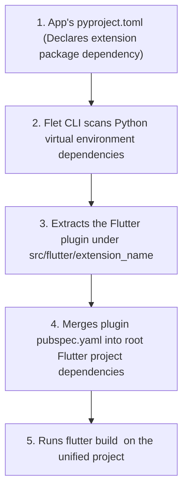
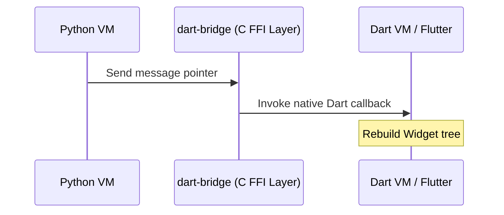

# Flet Extensions: Under the Hood Architecture & Compilation Pipeline

This research report details the low-level architecture, compile-time orchestration, and runtime mechanics of the Flet extension framework. It documents how Flet binds Python application code to Flutter widgets, focusing on the C-based FFI layer (`dart-bridge`), the embedded Python runtime (`serious_python`), and high-performance direct memory transfers via `DataChannel`.

---

## 1. Compile-Time Orchestration: How `flet build` Integrates Extensions

Flet apps run Python logic but are packaged inside a Flutter project runner. During compilation, the `flet build` CLI performs an automated dependency merge:



### The Merging Mechanics
1.  **Detection**: The CLI parses the virtual environment's dependencies to find packages registered with Flet metadata.
2.  **Code Extraction**: For each found extension, the CLI extracts the Dart plugin package (located under `src/flutter/<extension_name>/`) and copies it to a temporary build directory.
3.  **Manifest Merging**: The dependencies listed in the extension's `pubspec.yaml` (including third-party Flutter packages like `flutter_spinkit`) are dynamically injected into the root Flutter host application's `pubspec.yaml`.
4.  **Compilation**: Flutter runs `flutter pub get` followed by `flutter build <platform>`. The Dart compilation engine builds a single unified native binary containing:
    *   The Flet framework client
    *   The `serious_python` runtime
    *   All custom extension widgets and their third-party Flutter libraries

---

## 2. In-Process Transport: The FFI Bridge (`serious_python` & `dart-bridge`)

Historically, Flet communicated between Python and Dart via local TCP sockets or WebSockets. In modern releases (Flet 0.86.0+), this has been replaced with an in-process Foreign Function Interface (FFI) transport to eliminate socket latency and serialization bottlenecks.



### Key Components of the Runtime Bridge:
*   **`serious_python`**: A cross-platform Flutter plugin that embeds a standard CPython interpreter. It boots the Python runtime in a background OS thread so it does not block Flutter's main UI thread.
*   **`dart-bridge`**: A C-based library that implements low-level, in-process byte transport between the Python thread and the Dart VM. It uses Dart FFI to pass binary arrays directly in memory, avoiding network overhead.
*   **MsgPack Protocol**: General widget structure changes and standard properties are serialized into MsgPack frames on the Python side, pushed through `dart-bridge`, and deserialized on the Dart side.

---

## 3. High-Performance Data Transfer: `DataChannels`

For widgets that stream bulk binary payloads (such as raw images, camera frames, PCM audio, or ML inference arrays), serializing via MsgPack is a bottleneck. Flet provides **`DataChannels`** which bypass standard control serialization.

### Wire-Format and Transport Mechanics
When a widget opens a `DataChannel`:
1.  **Allocation**: The Dart state calls `FletBackend.of(context).openDataChannel()` which reserves a unique integer ID.
2.  **Notification**: Dart notifies Python about the channel by triggering a `data_channel_open` event containing the channel ID.
3.  **Bridge Binding**: The Python class captures this event, calls `self.get_data_channel(channel_id)`, and retrieves a direct FFI pipe pointer.
4.  **Zero-Copy Send**: When Python calls `channel.send(bytes)`, the bytes are written to a native C memory buffer. On platforms running embedded native code (desktop/mobile), Dart accesses this memory directly without socket parsing. On web deployments (Pyodide Wasm), this is multiplexed over `postMessage` using transferable `ArrayBuffer` objects for zero-copy memory ownership transfers.

---

## 4. Dart Registration and Extension APIs

Custom extensions must extend `FletExtension` (defined in `package:flet/flet.dart`). This base class provides hooks to initialize libraries, bind custom widgets, and spawn background services.

### The FletExtension Base Class Surface
```dart
abstract class FletExtension {
  // Hook called immediately after Flet initialization, before the first screen draw
  void ensureInitialized() {}

  // Factory hook to instantiate custom widgets based on Control.type
  Widget? createWidget(Control parent, Control control, List<Control> children) => null;

  // Factory hook to instantiate non-visual services (e.g., Clipboard, Accelerometer)
  FletService? createService(Control control) => null;

  // Custom boot screens shown during the serious_python unpacking/bootstrap stage
  Widget? createBootScreen(String name, Map<String, dynamic> options, ValueListenable<BootStatus> status) => null;
}
```

---

## 5. Critical Implementation Rules

### 1. Default Values Mismatch Bug
Flet optimizes network traffic by **not transmitting properties** that remain at their Python default values. 

> [!CAUTION]
> If Python declares:
> ```python
> size: float = 120.0
> ```
> And your Dart implementation accesses it using:
> ```dart
> final size = control.getDouble("size"); // returns null!
> ```
> The Dart side will receive `null` whenever a developer leaves the size at `120.0` in Python. To prevent crashes, Dart **must** define the exact same default:
> ```dart
> final size = control.getDouble("size", 120.0)!; // Correct
> ```

### 2. Thread Safety and Backpressure
Python executes inside a separate OS thread managed by `serious_python`. When Dart sends data back via a `DataChannel`, the Python callback (`on_bytes`) runs on the delivery thread under the Global Interpreter Lock (GIL).

*   **Avoid CPU-Heavy Tasks in Callback**: Do not perform processing (like image manipulation or ML evaluation) directly in the `on_bytes` callback. This blocks the FFI transport loop and starves the UI thread.
*   **Queue Architecture**: Push the incoming binary array onto a thread-safe `queue.Queue` or `asyncio.Queue` and process it using a worker thread.
*   **Matplotlib Flow Control**: For high-rate streams, implement an acknowledgment frame. The Dart client sends a `1-byte` ACK once it finishes painting a frame, and Python waits for this ACK before pushing the next frame. This prevents memory leaks from queue backlogs.
