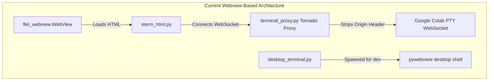
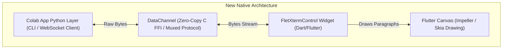

# Comprehensive Technical Implementation Plan: `flet-xterm` Native Terminal Extension

This implementation plan outlines the architecture, data transport protocols, and design requirements for **`flet-xterm`**—a production-grade, native terminal emulator extension for the Flet ecosystem built on top of **`xterm.dart`** (`^3.2.6`).

Our goal is to build a general-purpose, reusable terminal widget that can be published to PyPI for all Flet developers, while integrating it as the core terminal container inside the Colab Shell application.

---

## 1. Deconstruction & Analysis of Current Setup

To ensure we do not introduce a "one step forward, two steps back" scenario, we must understand the precise role of the existing files being eliminated or replaced:



### Why they exist:
1.  **`src/services/terminal_proxy.py`**: Web browsers (and WebViews) automatically attach an `Origin` header when initiating a WebSocket connection. Google Colab's Jupyter proxy rejects any socket request carrying an unrecognized browser origin with an HTTP 404. The Tornado proxy runs locally on `127.0.0.1`, accepts origin-free local WebView connections, and connects upstream to Colab without an `Origin` header to bypass this security check.
2.  **`src/services/xterm_html.py`**: Generates a massive HTML/JS string wrapper containing `xterm.js`, its fitting addon, and a custom touch accessory bar. This is injected into the WebView.
3.  **`src/desktop_terminal.py`**: The default prebuilt Flet desktop runner (`flet run` on Windows/Linux) does not support WebView controls. To allow terminal testing during desktop development, this script spawns a separate `pywebview` subprocess.

---

## 2. The New Architecture: `flet-xterm`

Instead of wrapping a browser rendering pipeline, **`flet-xterm`** binds the terminal emulation engine directly to Flutter's native render canvas.



### Key Improvements:
*   **Direct Drawing**: `xterm.dart` utilizes a `CustomPainter` that renders text paragraphs and grid cells directly onto the Flutter canvas via GPU-accelerated pipelines (Skia/Impeller).
*   **Native Keyboard & IME**: Integrates directly with Flutter’s `TextInputClient`, bypassing hidden `<textarea>` HTML focus hacks and solving mobile virtual keyboard layout shifts.
*   **Decoupled Design**: The widget is a pure terminal canvas. It has no knowledge of WebSockets, SSH, or Google Colab. It only consumes character streams and emits keypress events, making it a general-purpose widget for any stream (PTY, SSH, Serial, Serializer).
*   **Eliminating Proxy Overhead**: Since Python (via `serious_python` on mobile or local native runtime on desktop) manages the upstream WebSocket to Google Colab directly, it bypasses browser sandbox origins completely. No local Tornado server or local port bindings are required.

---

## 3. Data Transport: `DataChannels`

To achieve 60fps rendering under heavy terminal output (e.g. running `top` or dumping large logs), we will use Flet's **`DataChannel`** protocol for zero-copy binary streaming:

1.  **Mount & Allocation**: When the `FletXtermControl` Dart widget mounts:
    ```dart
    final channel = FletBackend.of(context).openDataChannel();
    final channelId = channel.id;
    // Fire control event carrying the channel ID to Python
    FletBackend.of(context).triggerControlEvent(control, "data_channel_open", {"channel_name": "pty", "channel_id": channelId});
    ```
2.  **Binding**: Python receives the event and retrieves the channel:
    ```python
    def _on_data_channel_open(self, e):
        self._channel = self.get_data_channel(e.channel_id)
        self._channel.on_bytes(self._on_bytes_received)
    ```
3.  **Zero-Copy Execution**:
    *   *Python → Dart*: When Colab pushes stdout, Python calls `self._channel.send(bytes)`. On mobile/desktop builds, this goes directly through native C memory pointers (`dart-bridge` FFI).
    *   *Dart → Python*: When the user types, the Dart widget streams the character codes back via `channel.send(bytes)`, and Python forwards them to the Colab PTY.
    *   *Muxed Fallback*: If running on non-compiled web/dev runners, Flet automatically multiplexes these bytes over the standard WebSocket channel under type-byte `0x01`, preserving functionality.

---

## 4. Proposed Control APIs & Interface Definitions

### Python API (`flet_xterm/xterm.py`)

```python
import flet as ft
from typing import Optional, Any

@ft.control("FletXterm")
class FletXterm(ft.LayoutControl):
    # Core attributes
    scrollback: Optional[int] = ft.field(default=10000)
    font_family: Optional[str] = ft.field(default="JetBrains Mono")
    font_size: Optional[float] = ft.field(default=13.0)
    cursor_blink: Optional[bool] = ft.field(default=True)
    cursor_style: Optional[str] = ft.field(default="block")  # "block", "underline", "bar"
    theme: Optional[dict[str, Any]] = ft.field(default=None)  # fg, bg, selection, palette
    read_only: Optional[bool] = ft.field(default=False)
    auto_focus: Optional[bool] = ft.field(default=True)

    # Event handlers
    on_data: Optional[ft.ControlEventHandler] = ft.field(default=None)
    on_resize: Optional[ft.ControlEventHandler] = ft.field(default=None)

    async def write_async(self, data: str | bytes):
        """Writes text or ANSI escape sequences into the terminal grid."""
        payload = data if isinstance(data, str) else data.decode("utf-8", errors="ignore")
        await self._invoke_method("write", {"data": payload})

    def write(self, data: str | bytes):
        self.page.run_task(self.write_async, data)

    async def clear_async(self):
        await self._invoke_method("clear")

    def clear(self):
        self.page.run_task(self.clear_async)

    async def focus_async(self):
        await self._invoke_method("focus")

    def focus(self):
        self.page.run_task(self.focus_async)
```

### Dart / Flutter API (`lib/src/flet_xterm.dart`)

```dart
import 'dart:convert';
import 'dart:typed_data';
import 'package:flet/flet.dart';
import 'package:flutter/material.dart';
import 'package:xterm/xterm.dart' as qt;
import 'package:xterm/flutter.dart' as qtf;

class FletXtermControl extends StatefulWidget {
  final Control control;
  const FletXtermControl({super.key, required this.control});

  @override
  State<FletXtermControl> createState() => _FletXtermControlState();
}

class _FletXtermControlState extends State<FletXtermControl> {
  late final qt.Terminal _terminal;
  final qt.TerminalController _terminalController = qt.TerminalController();
  DataChannel? _channel;
  StreamSubscription? _channelSub;

  @override
  void initState() {
    super.initState();
    widget.control.addInvokeMethodListener(_handleMethodCall);

    final maxLines = widget.control.getInt("scrollback", 10000)!;
    _terminal = qt.Terminal(maxLines: maxLines);

    // Setup input forwarding
    _terminal.onOutput = (String output) {
      if (_channel != null) {
        _channel!.send(Uint8List.fromList(utf8.encode(output)));
      } else {
        widget.control.triggerEvent("data", output);
      }
    };

    // Setup resize forwarding
    _terminal.onResize = (width, height, pixelWidth, pixelHeight) {
      widget.control.triggerEvent("resize", jsonEncode({
        "cols": width,
        "rows": height,
      }));
    };

    // Allocate DataChannel
    WidgetsBinding.instance.addPostFrameCallback((_) {
      if (!mounted) return;
      _channel = FletBackend.of(context).openDataChannel();
      _channelSub = _channel!.messages.listen((bytes) {
        setState(() {
          _terminal.write(utf8.decode(bytes, allowMalformed: true));
        });
      });
      widget.control.triggerEventWithoutSubscribers(
        "data_channel_open",
        jsonEncode({"channel_name": "pty", "channel_id": _channel!.id}),
      );
    });
  }

  Future<dynamic> _handleMethodCall(String name, dynamic args) async {
    if (name == "write") {
      setState(() {
        _terminal.write(args["data"] ?? "");
      });
    } else if (name == "clear") {
      setState(() {
        _terminal.clear();
      });
    } else if (name == "focus") {
      _terminalController.setFocus();
    }
  }

  @override
  Widget build(BuildContext context) {
    // Styling properties mapping...
    return LayoutControl(
      control: widget.control,
      child: RepaintBoundary(
        child: qtf.TerminalView(
          _terminal,
          controller: _terminalController,
          autofocus: widget.control.getBool("auto_focus", true)!,
        ),
      ),
    );
  }

  @override
  void dispose() {
    widget.control.removeInvokeMethodListener(_handleMethodCall);
    _channelSub?.cancel();
    _channel?.close();
    _terminalController.dispose();
    super.dispose();
  }
}
```

---

## 5. Development & Testing Workflow

> [!WARNING]
> **Scaffolding Integration in Development**:
> Because the custom Flutter extension contains native compiled Dart dependencies (`xterm.dart`), developers cannot run it inside Flet's precompiled desktop runner directly.
> 
> During local development:
> 1. Use the local path dependency in your app's `pyproject.toml` to point to the extension:
>    ```toml
>    [project]
>    dependencies = [
>        "flet-xterm @ {path = './packages/flet-xterm'}"
>    ]
>    ```
> 2. Build and run the development app using Flet's compiler rather than standard runner:
>    ```bash
>    flet build <platform> --no-packaging
>    ```
>    This forces the Flet build environment to merge `xterm` dependencies and run the fully compiled custom binary containing our new native widget code.

---

## 6. Detailed Walkthrough & Verification Plan

### Automated Checks:
*   Lint/compile the codebase with:
    ```bash
    uv run ruff check src/
    uv run python -m compileall src/
    ```

### Manual Verification Suite:
1.  **Onboarding & OAuth Flow**: Complete sign-in slides; check that standard stdin intercepts function correctly.
2.  **Direct PTY WebSocket**: Verify that Python opens `wss://...` directly to Google Colab and hooks terminal events with zero proxy bridges active.
3.  **Terminal Buffer Throughput**: Run high-rate printing commands and check for stuttering or dropped outputs.
4.  **Virtual Accessory Keyboard**: Test soft accessory keys (ESC, Tab, Sticky Ctrl/Alt, Directionals) to confirm keystroke forwarding.
5.  **Interactive Editor Session**: Run `vim` or `nano` in terminal; resize window to confirm viewport coordinates recalculate correctly.
