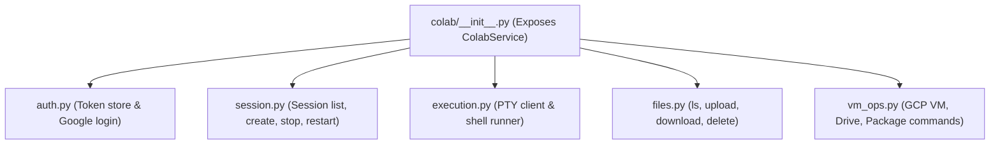
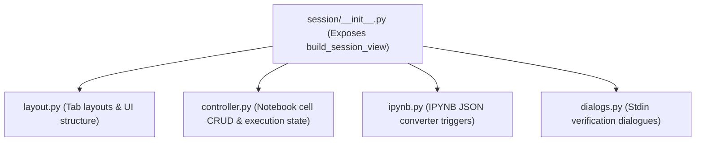

# Codebase Modularization & Refactoring Plan

This document outlines a plan to refactor and decompose the largest, high-line-count files in the project into highly organized, single-responsibility folder modules. It also includes the comprehensive test cases you need to verify all recent changes.

---

## Part 1: Source File Analysis & Line Count Audit

A line count audit of the `src/` directory reveals that a couple of modules carry the majority of the application's complexity:

| File Path | Line Count | Primary Responsibilities | Current Problem |
| :--- | :---: | :--- | :--- |
| **`src/services/colab_service.py`** | 1,384 | Auth, session lifecycle, PTY exec, file operations, GCP/Drive mounting. | Mixing VM lifecycle, PTY protocol, file streaming, and OAuth flow into one class. |
| **`src/views/session_view.py`** | 1,349 | Drawing notebook UI, cell operations (CRUD), IPYNB serialization, kernel interaction. | Mixing UI layout drawing, state change handlers, and serialization logic. |
| **`src/main.py`** | 816 | Application initialization, page routing, global stdin dialog hook, settings loading. | Handles multiple routes and houses global dialogs. (Appropriate size for main orchestrator). |
| **`src/views/settings_view.py`** | 737 | Settings cards, preferences store, auth controls, log toggles. | Large layout due to numerous Material card controls. Already relatively clean. |
| **`src/views/files_view.py`** | 627 | File list layout, upload/download triggers, delete/rename dialogs. | Standard size for a feature-heavy explorer layout. |

---

## Part 2: Proposed Modularization Architectures

We propose refactoring the two files exceeding 1,000 lines into structured sub-directories using Python package structures (directories with `__init__.py` files exposing clean APIs).

### 1. Splitting `colab_service.py` (From File to Package)
We will replace `src/services/colab_service.py` with a folder `src/services/colab/`:

*   **`colab/__init__.py`**: Re-assembles the `ColabService` class using mixins or composition to maintain backwards compatibility, so no views break.
*   **`colab/auth.py`**: Handles token directories, generating OAuth URLs, and credentials checking.
*   **`colab/session.py`**: Manages kernel restarts and VM provisioning logic.
*   **`colab/execution.py`**: Implements the Jupyter websocket execution protocol, output parsing, and stdout/stdin routing.
*   **`colab/files.py`**: Handles directory listings, zip compression for directories, and file streams.
*   **`colab/vm_ops.py`**: Houses command strings and API calls for mounting Google Drive, apt/pip package installation, and GCP credentials sync.

---

### 2. Splitting `session_view.py` (From File to Package)
We will replace `src/views/session_view.py` with a folder `src/views/session/`:

*   **`session/__init__.py`**: Defines the main entry point `build_session_view` and orchestrates view registration.
*   **`session/layout.py`**: Contains visual Flet components (Appbar, Tab selection layout, keep-alive card layouts, actions bar, bottom toolbar).
*   **`session/controller.py`**: Handles state callbacks (moving a cell up/down, deleting a cell, clearing output lines, updating running indicators).
*   **`session/ipynb.py`**: Handles uploading and downloading `.ipynb` files to/from local storage and parsing cells.
*   **`session/dialogs.py`**: Houses the modal dialogues for kernel restarts, VM shutdowns, and verification code typing (which now has `autofocus=False`).

---

## Part 3: Exhaustive Test Matrix & Checklist

Here is a reminder of every test case and validation scenario to execute to confirm that recent bug fixes and layout adjustments are fully operational:

### 1. Terminal Bottom Margin & Keys Row Layout
*   **What to test**: The active prompt line inside the terminal must not be obscured by the bottom keys bar or the mobile software keyboard.
*   **How to test**:
    1. Connect to a running session, and switch to the **Terminal** tab.
    2. Ensure there is a visible `30px` dark bottom padding area below the terminal prompt line, separating it from the helper key bar.
    3. Tap the command line to open your keyboard.
    4. Type commands. Verify that the terminal fits correctly inside the resized viewport and that you can read the active input prompt perfectly.

### 2. Mobile Download Filename Collision Renaming
*   **What to test**: File downloads should dynamically resolve name conflicts rather than throwing "Permission Denied".
*   **How to test**:
    1. Go to **Cloud Files** and select a file (e.g., `README.md`).
    2. Tap **Download**. Verify it saves to your device's `Download` directory.
    3. Download the exact same file a second time.
    4. Verify it saves successfully (no crashes) and creates `README (1).md` alongside `README.md`.

### 3. Notebook Editor Compact Height Cap
*   **What to test**: Cell text fields should not grow infinitely and take up the whole phone screen.
*   **How to test**:
    1. Inside a session, add a new **+ Code** cell.
    2. Paste 20 lines of code. Verify that the editor height is capped at exactly `10 lines` and displays a vertical scrollbar.
    3. Add a **+ Markdown** cell, type a long block, and verify that the editor height is capped at `8 lines`.

### 4. Authentication Autofocus Prevention
*   **What to test**: Dialogs must not trigger keyboard popups automatically on page mount.
*   **How to test**:
    1. Go to **Settings** -> **Authentication** and tap **Re-authenticate**.
    2. When the verification popup displays, check that your device's soft keyboard does **not** open automatically.
    3. Verify that the authentication browser URL link is completely visible.

### 5. Layout Spacing Tightness
*   **What to test**: UI gaps should feel tight and compact.
*   **How to test**:
    1. Navigate to the **Home** dashboard.
    2. Check the margins around list cards and quick action icons. Spacing should be tight, showing more items in the viewport.
